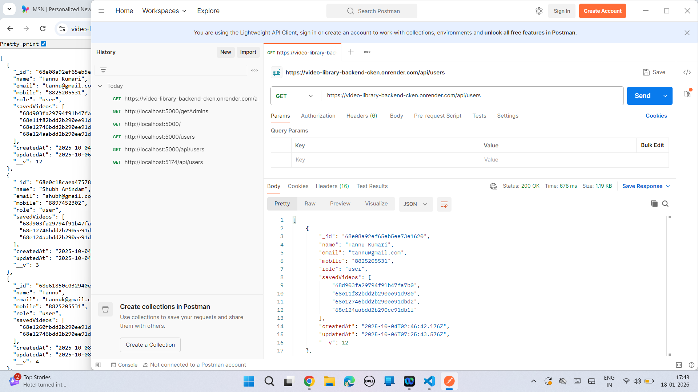
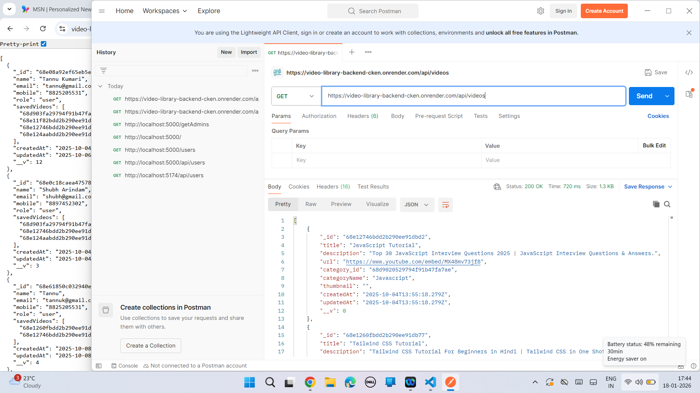
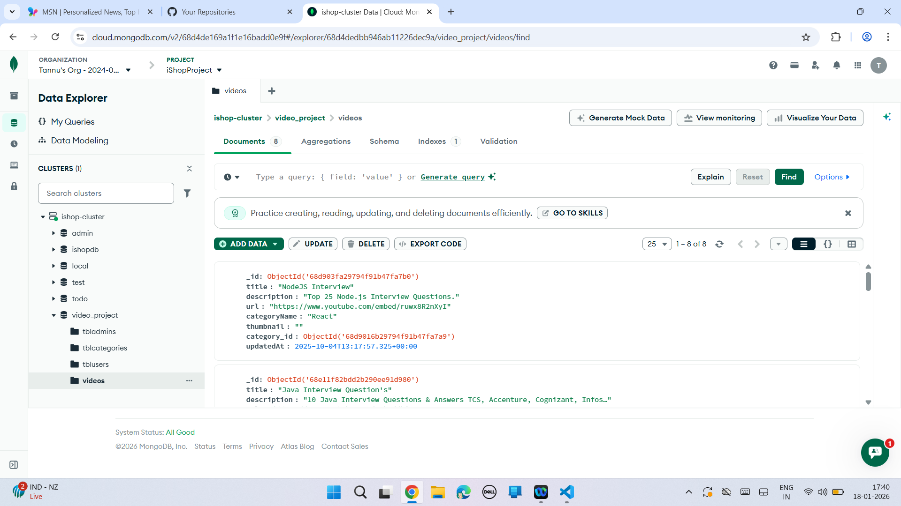

This repository contains the backend of the Video Library full-stack application. It handles authentication, video data management, and secure API communication.

## Tech Stack
- Node.js
- Express.js
- MongoDB
- JWT Authentication

## Features
- User authentication (Login / Logout)
- Protected routes using JWT
- Secure RESTful APIs
- MongoDB database integration
- Video data management

## Frontend Repository
https://github.com/Tannu-2001/video-library-frontend

## Environment Variables
Create a .env file and add:
PORT=5000
DB_NAME=video_project

## Run Locally
1. Clone the repository  
2. Run npm install  
3. Add environment variables  
4. Run npm start or npm run dev

## What I Learned
- Authentication using JWT
- Backend API security
- MongoDB schema design
- Full-stack backend architecture

## Future Improvements
- Video upload APIs
- Role-based access
- Improved authentication security

## Screenshots
### Get User API

### Get Video API

### MongoDB Collection

### Folder Structure

